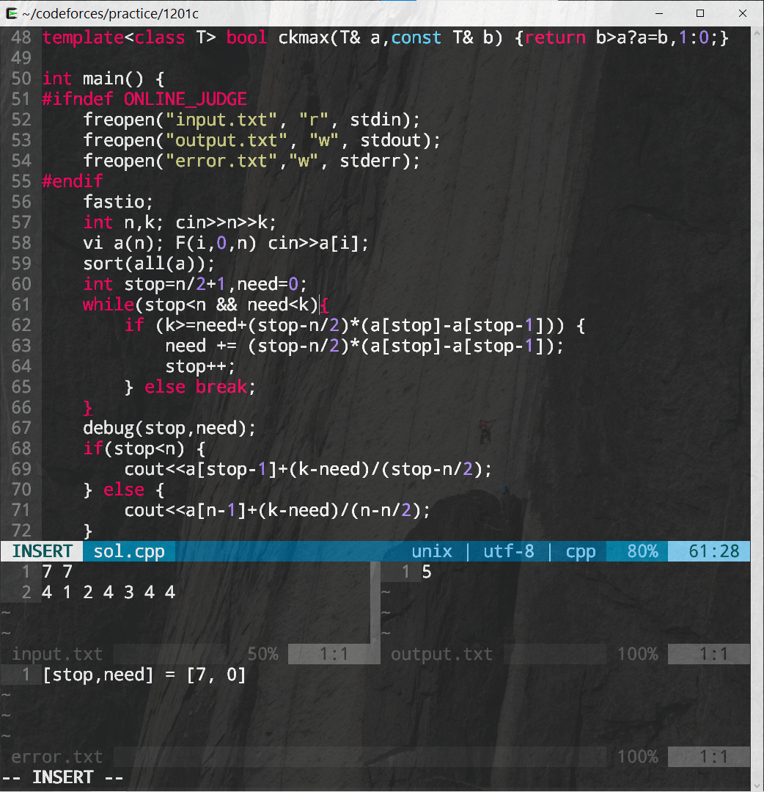

# codeforces
Solution dump for around 100 problems on codeforces + vim text editor and cygwin terminal configurations.
This repo is mainly to help sync my solutions across multiple machines.

Example of the current UI in terminal vim (press `vv` from command line):

Horitonztal layout mode with NERDtree plugin (press `vs` from command line):
![Horizontal mode in vim)(doc/vim_tiling_2.png)

## Cygwin Setup (for windows users only)
Install cygwin (https://cygwin.com/install.html) and select the following packages to install:
gcc-core
gcc-g++
gdb
git
make 
vim (8.2 or newer)
tree (optional, for directory viewing)

## Vim-plug setup
